# Fluxo de processamento: da transação ao alerta entregue

Mapa do fluxo **como está implementado**, com referência ao código. Cada etapa tem o seu diagrama; a visão geral só mostra como elas se encadeiam. Contratos em [contratos/](contratos/README.md).

## Sumário

0. [Visão geral](#0-visão-geral)
1. [Recebimento e validação](#1-recebimento-e-validação)
2. [Avaliação de regras e decisão](#2-avaliação-de-regras-e-decisão)
3. [Persistência atômica (alerta + outbox)](#3-persistência-atômica-alerta--outbox)
4. [Falhas transitórias e retentativas da entrada](#4-falhas-transitórias-e-retentativas-da-entrada)
5. [Publicação no SNS e marcos de tempo](#5-publicação-no-sns-e-marcos-de-tempo)
6. [Relay do outbox](#6-relay-do-outbox)
7. [Fan-out e consumo por canal](#7-fan-out-e-consumo-por-canal)
8. [Entrega idempotente ao canal](#8-entrega-idempotente-ao-canal)
9. [Escritas no banco](#9-escritas-no-banco)
10. [Garantias](#10-garantias)

---

## 0. Visão geral

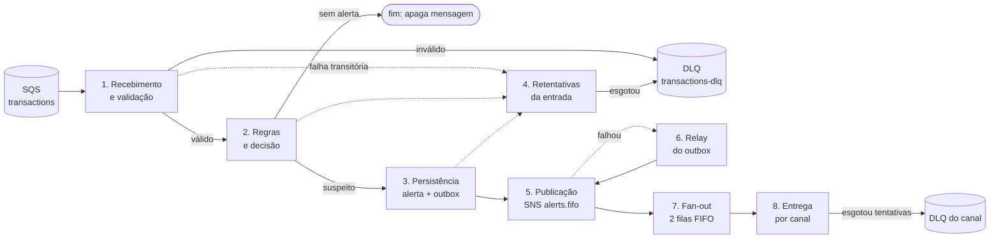

| Etapa | Classe / arquivo principal |
|---|---|
| 1 | `SqsTransactionConsumer` (`src/transactions/sqs-transaction.consumer.ts`), `AjvTransactionEventValidator`, `RejectInvalidEventService` |
| 2 | `ProcessTransactionService`, `DeclarativeRuleEngine`, `consolidate` (`src/alerts/decision.ts`) |
| 3 | `AlertRepository.saveWithOutbox` (`src/alerts/alert.repository.ts`) |
| 4 | `SqsTransactionConsumer.handleTransientFailure` |
| 5 | `OutboxEntryPublisherService`, `SnsEventBus` |
| 6 | `OutboxRelayScheduler`, `RelayOutboxService` |
| 7 | `infra/localstack/init-aws.sh`, `ChannelConsumers`, `SqsChannelConsumer` |
| 8 | `DeliverAlertService`, `DeliveryRepository`, `AntifraudQueueProvider`, `CustomerPushProvider` |

---

## 1. Recebimento e validação

`pollLoop` faz long polling (até 10 mensagens, espera de 2 s) e chama `handle()` em paralelo para cada uma. `handle()` **nunca lança**: qualquer falha deixa a mensagem na fila.

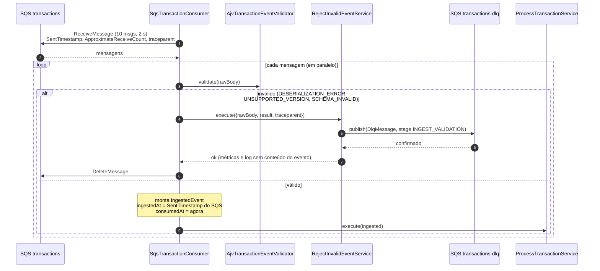

Pontos importantes:

- **A mensagem de entrada só é apagada depois que a DLQ confirmou.** Se o envio à DLQ falhar, `RejectInvalidEventService` lança e a mensagem volta à fila.
- `ingestedAt` vem do relógio do broker (`SentTimestamp`), não do produtor. Se o atributo faltar, usa-se o relógio local.
- Log e métricas da rejeição carregam só o código do motivo e o caminho do campo, nunca o conteúdo.

---

## 2. Avaliação de regras e decisão

`ProcessTransactionService.execute` (`process-transaction.service.ts:236`) decide se há alerta. Esta etapa não toca no banco.

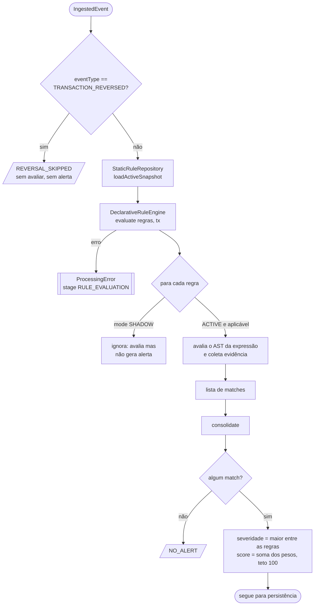

- Regras vêm de `config/rules.json` (sem redeploy de código). Regras em `SHADOW` são avaliadas, mas nunca geram alerta.
- A evidência nunca inclui dados de origem (IP, geolocalização).
- A decisão é determinística: o relógio e o gerador de id são injetáveis (`now`, `newId`) e há teste de determinismo (`determinism.spec.ts`).

---

## 3. Persistência atômica (alerta + outbox)

O alerta é montado (`status: OPEN`, `dedupeKey = dedupeKeyOf(transactionId)`, um alerta por transação) e gravado junto com a linha do outbox, **na mesma transação**.

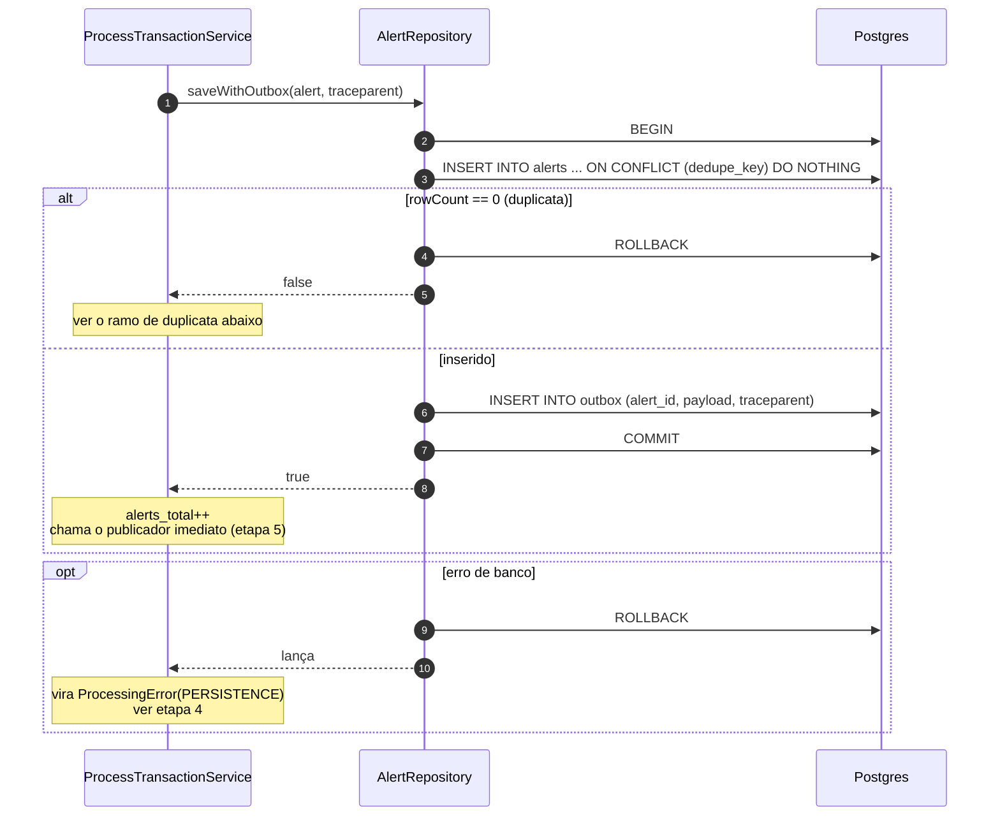

**Ramo de duplicata** (reentrega do evento de entrada):

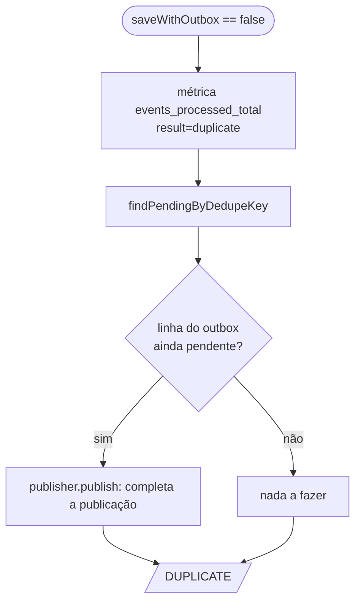

Nenhum alerta novo é criado. Se o processo tinha caído depois do commit e antes da publicação, a reentrega completa o trabalho.

---

## 4. Falhas transitórias e retentativas da entrada

`ProcessTransactionService` só lança nas falhas transitórias (`RULE_EVALUATION` e `PERSISTENCE`). O consumidor decide entre retentar e mandar à DLQ em `handleTransientFailure`.

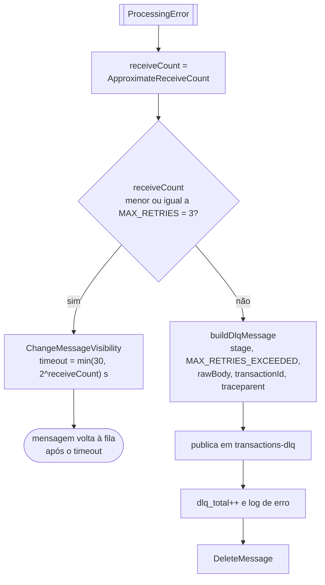

| Tentativa (receiveCount) | Próxima visibilidade |
|---|---|
| 1 | 2 s |
| 2 | 4 s |
| 3 | 8 s |
| 4 | vai à DLQ |

- Em qualquer falha de infraestrutura fora desse caminho (por exemplo, o próprio `ChangeMessageVisibility`), o `catch` externo de `handle()` só registra e a mensagem volta ao fim da visibilidade padrão da fila.
- Como rede de segurança extra, a fila `transactions` tem uma redrive policy para a `transactions-dlq` com `maxReceiveCount=10` (`init-aws.sh:10`).

---

## 5. Publicação no SNS e marcos de tempo

Logo após o commit, `OutboxEntryPublisherService.publish` envia o alerta ao tópico FIFO `alerts.fifo` e marca a linha como publicada. **Nunca lança**: se falhar, o relay assume.

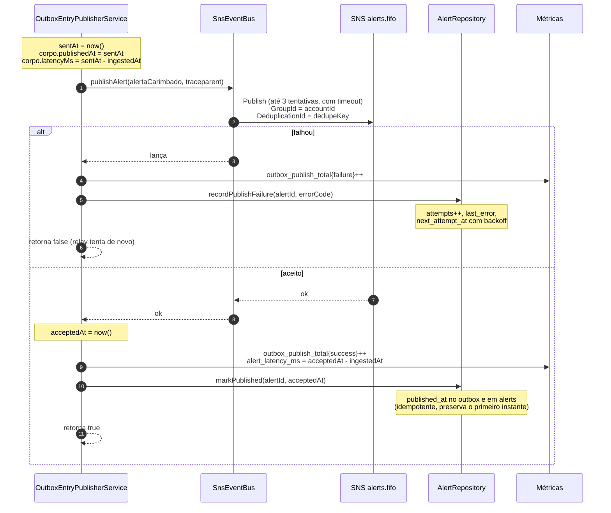

### Dois instantes, dois significados

O contrato exige `publishedAt` no corpo da mensagem, mas o aceite pelo SNS só é conhecido depois do `publish`. Por isso há dois relógios:

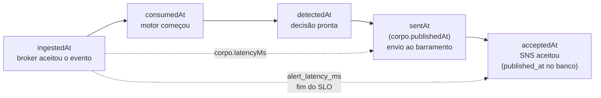

| Valor | Instante | Onde aparece |
|---|---|---|
| `publishedAt` e `latencyMs` do **corpo** | `sentAt`: momento do envio ao barramento, tirado antes do `publish` | Mensagem entregue aos consumidores do tópico |
| `alert_latency_ms` | `acceptedAt`: após o `await bus.publishAlert(...)` | Métrica; é o que mede o SLO |
| `published_at` (`outbox` e `alerts`) | `acceptedAt` | Banco; usado por `scripts/load-test.ts` |

`acceptedAt` inclui o tempo do `publish` com timeout e retentativas, então é igual ou maior que `sentAt`. Em condições normais a diferença é de poucos ms; sob lentidão do SNS, ela é justamente o que a métrica passa a mostrar. O tempo do `markPublished` fica fora das duas medições.

Se o SNS aceitou mas o `markPublished` falhou, o publicador só registra um aviso. O relay republica depois e o SNS FIFO descarta a duplicata pelo `dedupeKey`, valendo o primeiro envio.

---

## 6. Relay do outbox

Cobre dois casos: a publicação imediata falhou, ou o processo caiu depois do commit e antes de publicar.

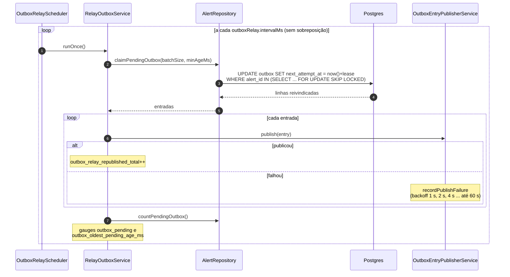

- Só pega linhas **sem `published_at`**, com `next_attempt_at` vencido e criadas há mais de `minAgeMs`. Assim o relay não disputa com a publicação imediata.
- `FOR UPDATE SKIP LOCKED` mais o lease em `next_attempt_at` evitam que duas instâncias processem a mesma linha.
- O agendador só liga se `consumers.enabled`, usa `setInterval` com `unref()` e, no desligamento, espera a execução corrente terminar.

---

## 7. Fan-out e consumo por canal

O SNS FIFO distribui o mesmo alerta para uma fila FIFO por canal (`RawMessageDelivery=true`, então o corpo é o `FraudAlert` puro).

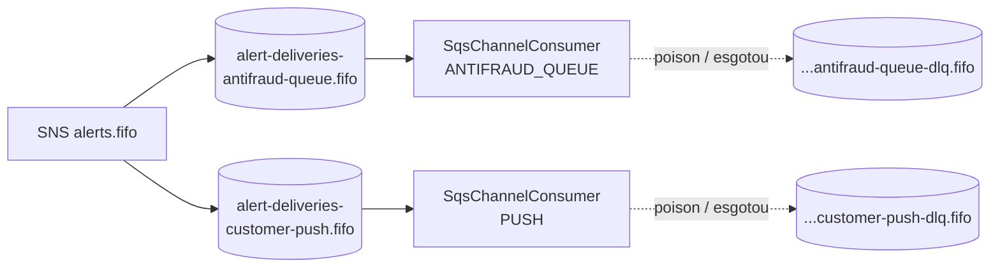

`ChannelConsumers` sobe um `SqsChannelConsumer` por provedor, cada um com seus próprios loops, então **um canal lento ou fora do ar não bloqueia o outro**. Só sobem se `consumers.enabled` e `consumers.channelsEnabled`.

Dentro de cada consumidor, a ordem por conta é preservada:

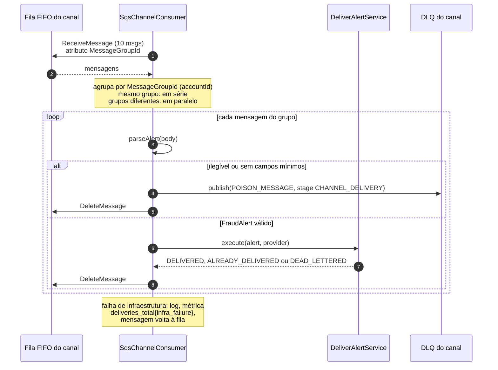

A mensagem só é apagada depois de `DELIVERED`, `ALREADY_DELIVERED`, `DEAD_LETTERED` (já gravado na DLQ) ou da rejeição de uma mensagem veneno.

---

## 8. Entrega idempotente ao canal

`DeliverAlertService.execute` entrega o alerta a **um** canal. O `deliveryId` é estável (`deliveryIdOf(alertId, channel)`), então reentregas não duplicam o envio.

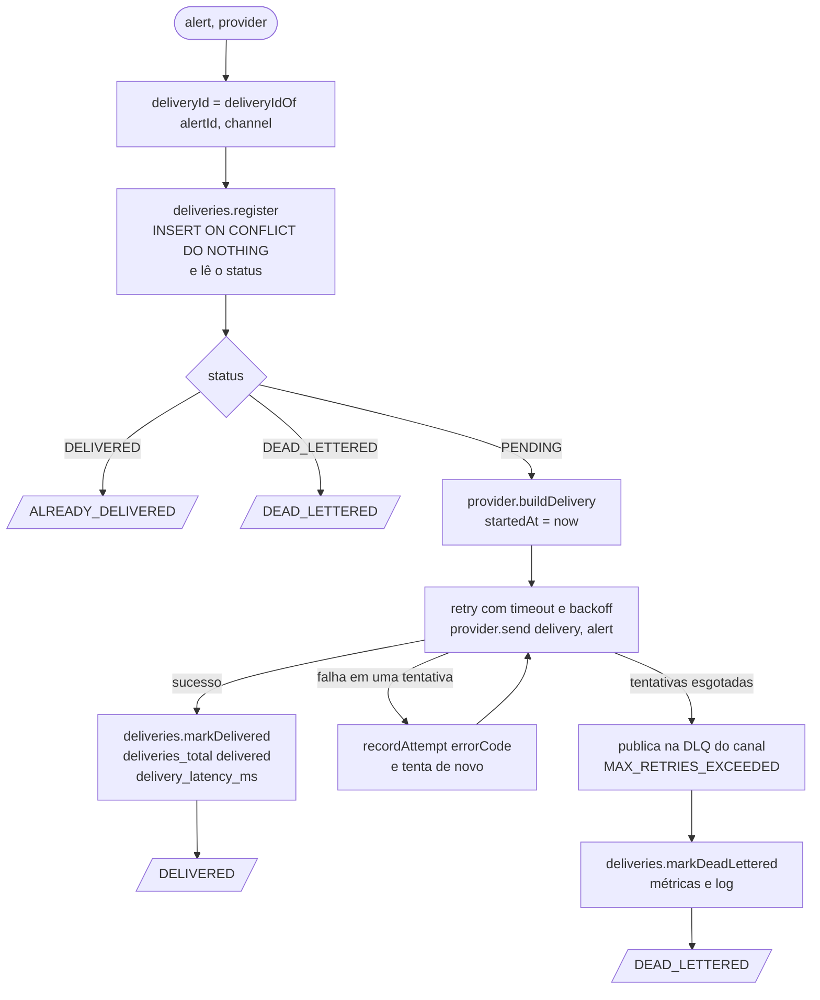

Os dois provedores são simulados e diferem no conteúdo enviado:

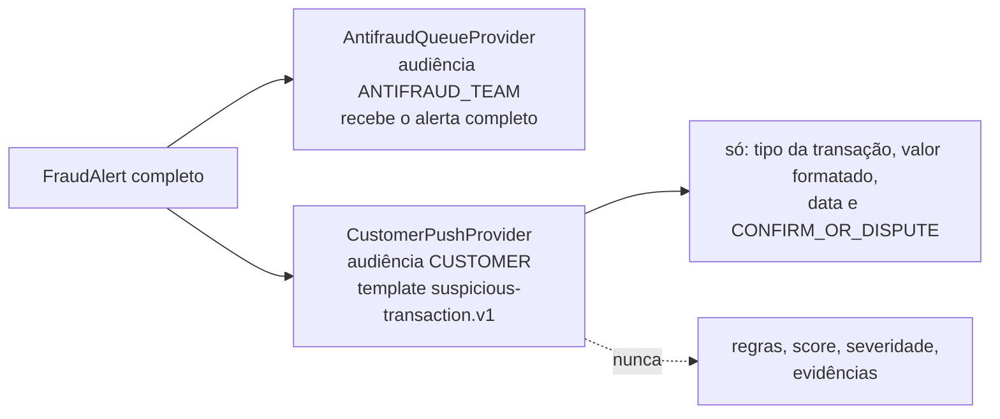

- `DELIVERY_TTL_MS` (10 min) define o `expiresAt` da entrega.
- Só lança em falha de infraestrutura (banco ou DLQ). Nesse caso o consumidor mantém a mensagem na fila para reentrega.
- A DLQ por canal é escolhida em `dlqQueues[channel]`; sem DLQ configurada, o serviço lança em vez de perder a mensagem.

---

## 9. Escritas no banco

Caminho feliz, para um alerta e os dois canais: **8 escritas de linha em 6 commits**.

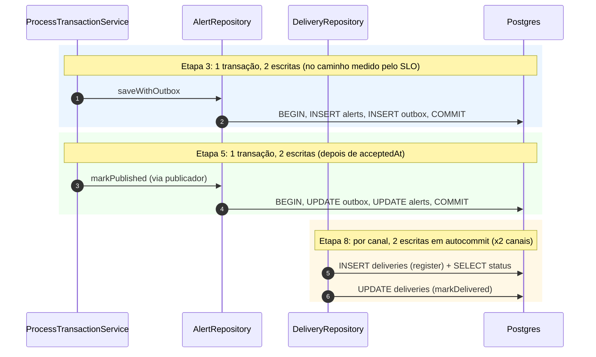

| Situação | Escritas |
|---|---|
| Estorno, sem regra acionada, evento inválido (DLQ no SQS) | 0 |
| Alerta criado, caminho feliz | 2 (criação) + 2 (publicação) + 2 por canal (entrega) |
| Duplicata | 0 linhas (abre transação, `ROLLBACK`); +2 se completar a publicação pendente |
| Falha de publicação no SNS | +1 UPDATE em `outbox` por tentativa (`recordPublishFailure`) |
| Relay reivindicando uma linha | +1 UPDATE (lease em `next_attempt_at`), mais o `markPublished` se der certo |
| Falha de entrega num canal | +1 UPDATE em `deliveries` por tentativa que falhou; +1 no `markDeadLettered` se esgotar |

Só a etapa 3 está no caminho medido pelo SLO (`ingestedAt` até `acceptedAt`). O `markPublished` e as escritas de entrega ocorrem depois.

---

## 10. Garantias

| Garantia | Como o código a entrega |
|---|---|
| Sem perda silenciosa | A mensagem de entrada só é apagada após processar ou após a DLQ confirmar. O mesmo vale para a mensagem de cada canal. |
| Alerta nunca sem publicação pendente | Alerta e outbox são gravados na mesma transação; o relay republica o que ficou pendente. |
| Um alerta por transação | `dedupe_key` único no banco (`ON CONFLICT DO NOTHING`). |
| Sem duplicata no barramento | `MessageDeduplicationId = dedupeKey` no SNS FIFO. |
| Sem entrega duplicada ao canal | `deliveryId` estável com INSERT idempotente em `deliveries`. |
| Ordem por conta | `MessageGroupId = accountId` no SNS e processamento em série por grupo no consumidor do canal. |
| Isolamento entre canais | Um consumidor, filas e DLQs próprias por canal. |
| Dados sensíveis | Log e métricas da rejeição não carregam conteúdo do evento; o push ao cliente não leva regras, score nem severidade. |
| Rastreabilidade | `traceparent` propaga da mensagem de entrada ao outbox e ao SNS; `traceId` vai no alerta e nas entregas. |
