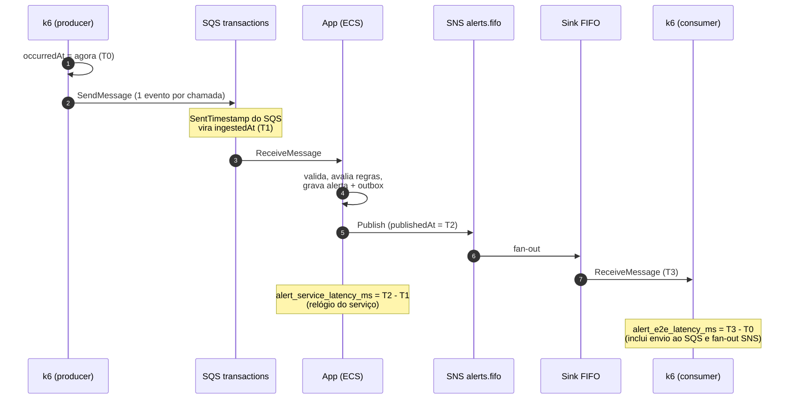
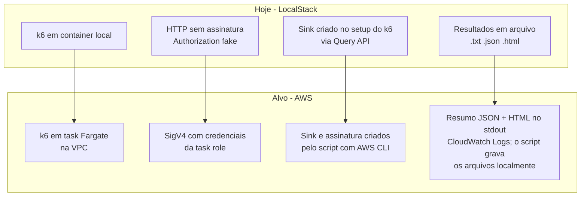
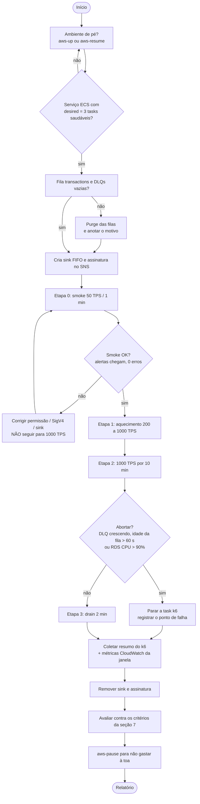
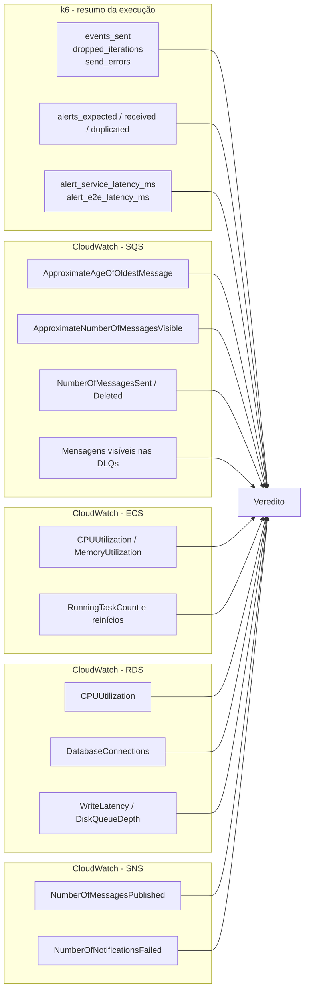
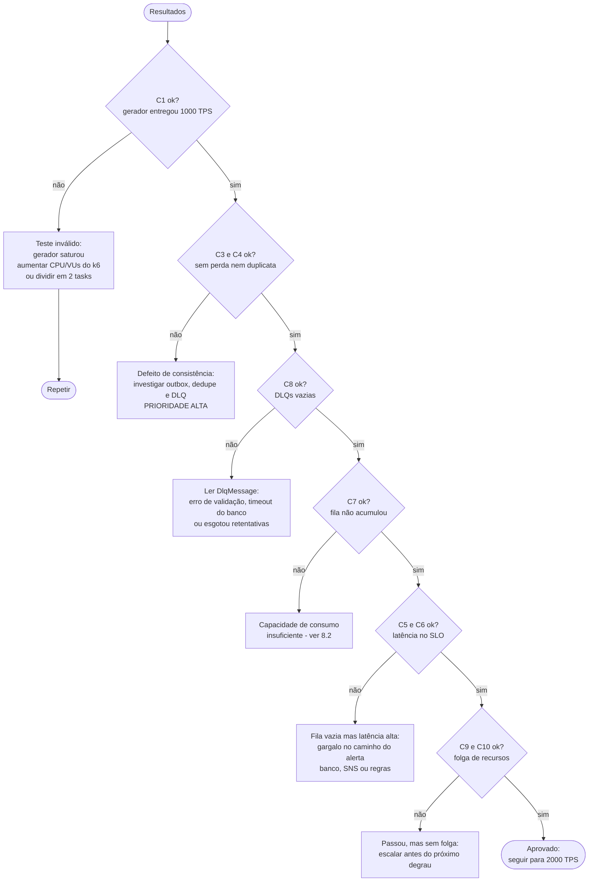
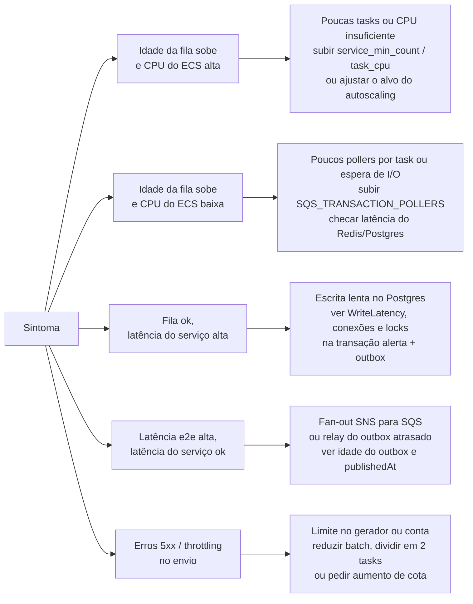

# Teste de carga na AWS — 1.000 TPS com k6

> Status: **plano (nada implementado)**. Este documento descreve como o teste será feito e como os resultados serão avaliados. A implementação só começa quando for pedida explicitamente.
> Contexto: o teste atual (`load/k6/`, ver [README](../load/k6/README.md)) roda contra o LocalStack e serve como regressão. Aqui o alvo é o ambiente real na AWS (perfil `lean`, ver [infra/terraform](../infra/terraform/README.md)).

## Sumário

1. [Objetivo e pergunta que o teste responde](#1-objetivo-e-pergunta-que-o-teste-responde)
2. [Arquitetura do teste](#2-arquitetura-do-teste)
3. [Perfil de carga](#3-perfil-de-carga)
4. [O que precisa mudar (quando for implementar)](#4-o-que-precisa-mudar-quando-for-implementar)
5. [Execução passo a passo](#5-execução-passo-a-passo)
6. [O que será medido e onde](#6-o-que-será-medido-e-onde)
7. [Critérios de aceite](#7-critérios-de-aceite)
8. [Como interpretar os resultados](#8-como-interpretar-os-resultados)
9. [Riscos, custo e segurança](#9-riscos-custo-e-segurança)
10. [Modelo de relatório](#10-modelo-de-relatório)
11. [Decisões em aberto](#11-decisões-em-aberto)

---

## 1. Objetivo e pergunta que o teste responde

O enunciado pede **8.000 TPS (picos de 25k) com alerta em até 500 ms**. Antes de chegar lá, o primeiro degrau é **1.000 TPS**:

> A 1.000 TPS sustentados, o pipeline na AWS entrega todos os alertas, sem duplicar, dentro de 500 ms (p95), e quanto de folga ainda sobra em cada componente?

O teste **não** busca o ponto de ruptura. Ele estabelece a linha de base (1/8 da meta) e mostra qual componente satura primeiro, para decidir o tamanho do próximo degrau (2k, 4k, 8k).

| Pergunta | Como é respondida |
|---|---|
| Aguenta 1.000 TPS sem acumular fila? | Idade da mensagem mais antiga em `transactions` e `dropped_iterations` do k6 |
| Latência do alerta está dentro do SLO? | `alert_service_latency_ms` (serviço) e `alert_e2e_latency_ms` (k6) |
| Perdeu ou duplicou alertas? | Alertas esperados × recebidos × únicos |
| Quem satura primeiro? | CPU do ECS e do RDS, conexões do Postgres, DLQs |
| Quanto custou? | Duração da janela de teste e Cost Explorer |

---

## 2. Arquitetura do teste

O gerador **roda dentro da VPC**, em uma task Fargate (módulo `enable_loadtest=true` já existente no Terraform). Rodar da máquina local mediria a internet e a banda do notebook, não o sistema.

```mermaid
flowchart LR
    subgraph OP[Operador]
        SH[loadtest.sh<br/>orquestra o teste]
    end

    subgraph VPC[VPC - subnets privadas]
        K6[Task Fargate k6<br/>2 vCPU / 4 GB<br/>producer + consumer]
        APP[Serviço ECS fraud-detector<br/>3 a 6 tasks Fargate On-Demand (override do teste)]
        PG[(RDS Postgres<br/>alerts, outbox, deliveries)]
        RD[(ElastiCache Redis)]
    end

    subgraph AWSMGD[Serviços gerenciados AWS]
        Q[(SQS transactions)]
        T{{SNS alerts.fifo}}
        CH1[(SQS FIFO<br/>antifraud)]
        CH2[(SQS FIFO<br/>customer)]
        SINK[(SQS FIFO sink<br/>alerts-loadtest.fifo)]
        CW[CloudWatch<br/>métricas e logs]
    end

    SH -- 1 cria sink e assina no SNS --> SINK
    SH -- 2 ecs run-task --> K6
    K6 -- 3 SendMessage individual<br/>1.000 req/s --> Q
    Q --> APP
    APP --> PG
    APP --> RD
    APP -- publica alerta --> T
    T --> CH1
    T --> CH2
    T -- cópia para o teste --> SINK
    SINK -- 4 ReceiveMessage<br/>mede latência --> K6
    K6 -- resumo JSON + HTML no stdout --> CW
    APP -. métricas .-> CW
    Q -. métricas .-> CW
    PG -. métricas .-> CW
    SH -- 5 coleta logs e métricas<br/>grava HTML em load/k6/results --> CW
    SH -- 6 remove sink e assinatura --> SINK
```

**Por que uma fila-sink assinada no tópico?** Ela recebe uma cópia de cada alerta sem interferir nas filas de canal que o app consome. É o mesmo desenho do teste local.

### Como a latência é medida



| Métrica | Intervalo | Papel |
|---|---|---|
| `alert_service_latency_ms` | T1 → T2 | **Referência do SLO** do serviço (500 ms) |
| `alert_e2e_latency_ms` | T0 → T3 | Visão do usuário: soma envio ao SQS, fila, serviço e fan-out SNS→SQS |

O produtor e o consumidor estão na **mesma task**, então T0 e T3 usam o mesmo relógio. T1 e T2 vêm do serviço e do SQS, por isso a métrica de serviço é a mais confiável para o SLO.

---

## 3. Perfil de carga

Taxa de alertas de **1%**, não os 0,1% de projeto: a 1.000 TPS isso dá 10 alertas/s e ~6.000 amostras em 10 min, o suficiente para um p99 confiável. A 0,1% seriam ~600 amostras e o p99 ficaria ruidoso. O caso de 0,1% (valor de projeto) é coberto pelo fato de que o custo por evento sem alerta é menor.

| Etapa | Taxa | Duração | Taxa de alertas | Objetivo |
|---|---|---|---|---|
| 0. Smoke | 50 TPS | 1 min | 20% | Validar permissões, SigV4, sink e coleta de resultados |
| 1. Aquecimento | 200 → 1.000 TPS | 3 min | 1% | Deixar o autoscaling e os pools de conexão estabilizarem |
| 2. **Sustentado** | **1.000 TPS** | **10 min** | **1%** | **Janela de medição principal** |
| 3. Cauda | 0 TPS | 2 min (drain) | — | Esperar os últimos alertas e a fila zerar |

```mermaid
gantt
    title Linha do tempo de uma execução (≈ 16 min de carga)
    dateFormat  HH:mm
    axisFormat  %H:%M
    section Preparação
    Resume do ambiente (aws-resume)      :prep1, 00:00, 10m
    Sink + assinatura SNS                :prep2, after prep1, 1m
    section Carga
    Smoke 50 TPS                         :load0, after prep2, 1m
    Aquecimento 200 a 1000 TPS           :load1, after load0, 3m
    Sustentado 1000 TPS (medição)        :crit, load2, after load1, 10m
    Drain                                :load3, after load2, 2m
    section Encerramento
    Coleta de métricas e relatório       :end1, after load3, 5m
    Remove sink e pausa (aws-pause)      :end2, after end1, 5m
```



A janela de medição para os critérios de aceite é **só a etapa 2**. O aquecimento aparece no relatório, mas não entra nos percentis.

### Segunda rodada (opcional, depois de passar)

| Rodada | Taxa de alertas | Para que serve |
|---|---|---|
| A (principal) | 1% | Linha de base e percentis |
| B | 5% (limite superior da pesquisa em [pesquisa-taxa-de-alertas.md](pesquisa-taxa-de-alertas.md)) | Estressa o caminho de escrita: 50 alertas/s no Postgres, no outbox e no SNS |

---

## 4. O que precisa mudar (quando for implementar)

Nada disto foi feito. É a lista do que a implementação vai tocar.



| # | Mudança | Detalhe |
|---|---|---|
| 1 | **Assinatura SigV4 no k6** | O k6 0.55 não assina requisições. Usar a lib `k6-jslib-aws` (`SQSClient` com `sendMessage`, `receiveMessages`, `deleteMessages`), lendo as credenciais da task role. Manter o modo LocalStack atrás de uma variável (`AWS_ENDPOINT`) para não perder o teste de regressão |
| 2 | **Envio individual (decidido)** | Um `SendMessage` por evento, como num produtor real: 1.000 requisições/s, cada evento com o próprio `occurredAt` (sem diluir o carimbo da latência). O custo é no gerador: assinar SigV4 e abrir TLS 1.000 vezes por segundo. Mitigações: começar com a task atual do k6 (2 vCPU / 4 GB; a necessidade real é uma estimativa, não foi medida), subir para 4 vCPU / 8 GB só se o smoke ou o aquecimento mostrarem saturação do gerador (`dropped_iterations` > 0 ou CPU da task do k6 > ~80%), VUs suficientes (≈ 1.000 × tempo de resposta do SQS, ~20 a 50 ms, ou seja 20 a 50 VUs ativos; `MAX_VUS` com folga), conexões HTTP reutilizadas. O smoke de 50 TPS e o aquecimento medem o teto do gerador antes da etapa principal. Se `dropped_iterations` > 0 mesmo com 4 vCPU, dividir em 2 tasks de 500 TPS (cada uma com seu `runId`) |
| 3 | **Sink fora do k6** | A lib não tem SNS. O script cria a fila FIFO, a policy que permite o tópico entregar nela e a assinatura (`RawMessageDelivery=true`), e remove tudo no fim |
| 4 | **Contagem de duplicados** | Hoje o k6 só conta alertas recebidos. Acrescentar o conjunto de `transactionId` já vistos e uma métrica `alerts_duplicated` (o FIFO deduplica por 5 min, mas queremos provar que o sistema não duplica) |
| 5 | **Script `loadtest.sh`** | Em `infra/terraform/scripts/`, no estilo de `up.sh`/`pause.sh`: valida pré-requisitos, cria o sink, roda a task, aguarda, coleta logs e métricas, limpa. Vira uma skill `aws-loadtest` como as de `.claude/skills/` |
| 6 | **Imagem do k6** | A task usa `grafana/k6:0.55.0` do Docker Hub (precisa do NAT, que o `lean` tem). O script do teste precisa chegar à task: empacotar em imagem própria no ECR (`FROM grafana/k6`, `COPY fraud-latency.js`) ou passar via variável. A imagem própria é mais simples e reprodutível |
| 7 | **Variáveis do Terraform** | Subir com `-var-file=lean.tfvars -var-file=loadtest.tfvars` (já criado; liga `enable_loadtest` e deixa o serviço On-Demand). O `ecs.tf` fixa a task do gerador em 2 vCPU / 4 GB, que é o ponto de partida; tornar o tamanho configurável é só uma otimização, caso o gerador sature. A task role já prevê `SendMessage` em `transactions`, gerência das filas `alerts-loadtest*.fifo` e `Subscribe/Unsubscribe` no tópico; conferir e ajustar quando for aplicar |
| 8 | **Pendência de bundle** | `handleSummary` baixa o `k6-reporter` do GitHub no momento da execução. Na AWS, vendorizar o arquivo na imagem para não depender de saída para a internet |
| 9 | **Resultados em HTML local** | A task Fargate não tem disco acessível. `handleSummary` imprime o `.json` e o `.html` no stdout, em base64 e em blocos de até ~200 KB (o limite de um evento do CloudWatch Logs é 256 KB), entre marcadores (`===K6-HTML-BEGIN <runId>===` ... `===K6-HTML-END===`). O `loadtest.sh` lê os logs da task (`aws logs get-log-events`), remonta os blocos e grava `load/k6/results/<timestamp>-aws.{txt,json,html}`, o mesmo diretório e formato do teste local (ignorado pelo git). Se o HTML não couber de forma prática, o fallback é um bucket S3 temporário na conta (ver seção 11) |

---

## 5. Execução passo a passo



Cada execução recebe um **identificador** (`runId`, já existente no k6) e os horários de início e fim da janela de medição, para filtrar logs e métricas depois.

---

## 6. O que será medido e onde



| Fonte | Métrica | Por que importa |
|---|---|---|
| k6 | `events_sent` ÷ duração | Confirma que o gerador entregou os 1.000 TPS (senão o teste é inválido) |
| k6 | `dropped_iterations` | Maior que 0 = o **gerador** saturou, não o sistema |
| k6 | `send_errors` | Erros de envio ao SQS (throttling, credenciais) |
| k6 | `alerts_expected/received/duplicated` | Perda e duplicidade |
| k6 | `alert_service_latency_ms`, `alert_e2e_latency_ms` | SLO de 500 ms |
| SQS `transactions` | `ApproximateAgeOfOldestMessage` | Sinal mais direto de que o consumo acompanha a entrada |
| SQS `transactions` | `NumberOfMessagesSent` × `NumberOfMessagesDeleted` | Vazão de entrada e de consumo; devem coincidir |
| SQS DLQs | mensagens visíveis | Qualquer valor acima de 0 é falha |
| ECS | CPU e memória (média e máx.) | Folga e gatilho do autoscaling (alvo de 60% de CPU) |
| ECS | `RunningTaskCount`, reinícios | Spot pode reclamar tasks no meio do teste |
| RDS | CPU, conexões, latência de escrita | Pool do app tem `max: 20` por task; 6 tasks = 120 conexões em `db.t4g.medium` |
| SNS | `NumberOfNotificationsFailed` | Falha de entrega nas filas assinantes |
| Logs do app | erros e retentativas (`ApproximateReceiveCount > 1`) | Falhas transitórias absorvidas |

As métricas do CloudWatch são coletadas pelo script com `aws cloudwatch get-metric-data` restrito à janela de medição, em granularidade de 1 minuto (ou 10 s para as de SQS e ECS, se estiver habilitada a alta resolução).

---

## 7. Critérios de aceite

Valem para a **etapa 2** (1.000 TPS sustentados). Todos precisam passar para o teste ser aprovado.

| # | Critério | Limite | Origem |
|---|---|---|---|
| C1 | Taxa de envio efetiva | ≥ 99% de 1.000 TPS e `dropped_iterations` = 0 | Validade do teste |
| C2 | Erros de envio (`send_errors`) | < 0,1% | `thresholds` do k6 |
| C3 | Alertas recebidos ÷ esperados | = 100% | Consistência |
| C4 | Alertas duplicados | = 0 | Idempotência |
| C5 | Latência de serviço p95 | < 500 ms | Enunciado |
| C6 | Latência de serviço p99 | < 500 ms | Enunciado; `P99_MS=500` no k6 |
| C7 | Idade da mensagem mais antiga em `transactions` | < 5 s na janela, volta a ≈ 0 no drain | Sem acúmulo |
| C8 | Mensagens nas DLQs | 0 | Resiliência |
| C9 | CPU média do ECS | < 75% | Folga para picos |
| C10 | CPU do RDS | < 60% | Folga para o caminho de escrita |
| C11 | Tasks reiniciadas por falha | 0 (reclamação de Spot é registrada à parte) | Estabilidade |

**Metas de folga** (não reprovam, mas entram no relatório): p99 do serviço < 300 ms; CPU do ECS < 50% (indica que 8k TPS é plausível só escalando de forma linear).

---

## 8. Como interpretar os resultados

### 8.1 Árvore de decisão



### 8.2 Onde procurar o gargalo



### 8.3 Leitura dos percentis

- **p95/p99 do serviço** é o número que responde ao enunciado. O e2e acompanha o serviço mais ~dezenas de ms de fan-out; uma diferença grande entre os dois aponta para SNS/SQS ou para o relógio.
- A latência **não deve crescer ao longo dos 10 min**. Um gráfico de p95 por minuto com inclinação positiva indica acúmulo (memória, conexões, backlog) mesmo que a média final passe.
- Os primeiros minutos após escalar mostram picos esperados (tasks novas, pool frio). Eles ficam na etapa 1 e não entram na medição.
- Mensagens entregues após retentativa (`ApproximateReceiveCount > 1`) têm latência maior por construção (visibility timeout de 10 s em `transactions`). Quantificar quantas foram, em vez de tratá-las como erro.

---

## 9. Riscos, custo e segurança

| Risco | Mitigação |
|---|---|
| **Spot reclama uma task** durante a janela | Evitado: o override `loadtest.tfvars` deixa o serviço 100% On-Demand durante o teste. Se uma task cair mesmo assim, registrar (`RunningTaskCount`) e repetir |
| **Autoscaling lento** (cooldown de scale-out 60 s) | O aquecimento da etapa 1 serve para isso; o `lean` já parte de 3 tasks |
| **Gerador vira o gargalo** (envio individual: 1.000 assinaturas SigV4/s) | Critério C1 e `dropped_iterations` denunciam; começa com 2 vCPU, smoke e aquecimento medem o teto antes (CPU da task do k6 > ~80% = subir para 4 vCPU); plano B de 2 tasks de 500 TPS |
| **Acumular lixo no banco** | O teste grava `alerts`, `outbox` e `deliveries` (~6.000 alertas por execução). Os IDs têm prefixo `k6-<runId>-` para limpar depois, ou o ambiente é destruído no fim |
| **Eventos do teste chegando a canais reais** | Os canais são simulados (`CHANNEL_*_FAIL`, provedores internos), sem destinatários reais. Confirmar antes de rodar |
| **Esquecer o ambiente ligado** | O script termina chamando `aws-pause`; o orçamento mensal (`monthly_budget_usd`) tem alarme |
| **Dados pessoais** | Os eventos são sintéticos (`cus_k6_*`, `acc_k6_*`); nada de PII. A task role do gerador é restrita ao necessário |

**Custo estimado de uma execução** (≈ 16 min de carga, mais o tempo de ambiente ligado): 1.000 TPS × 960 s ≈ 960 mil mensagens. Os custos de SQS (envio + recebimento + exclusão ≈ 3 requisições por mensagem, sem lote no envio) e SNS são da ordem de poucos dólares; o que pesa é o ambiente ligado (RDS, NAT, Fargate), já coberto pelo perfil `lean` e por `aws-pause`. Estimar o valor real após a primeira execução e registrar no relatório.

---

## 10. Modelo de relatório

Cada execução gera um arquivo `docs/resultados/teste-carga-AAAA-MM-DD-<runId>.md` (ou seção neste documento) com:

```markdown
# Teste de carga AWS — <data> — run <runId>

- Perfil: lean | commit: <sha> | imagem: <tag> | tasks ECS: <n> | RDS: <classe>
- Janela de medição: <início> a <fim> (UTC)

## Resultado: APROVADO | REPROVADO | INVÁLIDO

| Critério | Limite | Medido | Status |
|---|---|---|---|
| C1 Taxa efetiva | ≥ 990 TPS | ... | ok |
| ... | | | |

## Latência (ms) — serviço / e2e
| p50 | p95 | p99 | max |
| ... |

## Recursos (média / máx.)
ECS CPU, RDS CPU, conexões, idade da fila, tasks em execução

## Observações
Eventos relevantes (escala, reclamação de Spot, picos), gargalo identificado, custo da execução.

## Próximo passo
Repetir | corrigir X | subir para 2.000 TPS
```

---

## 11. Decisões em aberto

Decididas:

- **Envio individual** (um `SendMessage` por evento), sem lotes.
- **p99 do serviço < 500 ms** (mesmo limite do p95: o enunciado fala em alerta ≤ 500 ms), com `P99_MS=500`. Isso vale também para o e2e no `thresholds` do k6, que hoje usa `P99_MS` para as duas métricas.
- **Tasks do serviço On-Demand durante o teste**: custa centavos nas 1 a 2 h de teste (~US$ 0,12/h contra ~US$ 0,04/h em Spot, com 3 tasks) e evita que uma reclamação de Spot invalide a janela. Override em `infra/terraform/envs/production/loadtest.tfvars` (`fargate_base = 3`, `fargate_spot_weight = 0`, `enable_loadtest = true`), aplicado depois do `lean.tfvars` e revertido ao fim: `terraform apply -var-file=lean.tfvars -var-file=loadtest.tfvars ...`. O `loadtest.sh` fará o apply e a reversão.
- **Imagem própria do k6 no ECR** (`FROM grafana/k6`, com o script e o `k6-reporter` embutidos).
- **Resultados em HTML local**, via logs do CloudWatch (item 9 da seção 4).

Ainda em aberto:

1. **Fallback do HTML**: se o relatório HTML não couber nos logs de forma prática, aceitar um bucket S3 temporário (exige bucket e permissão `s3:PutObject` na task role)?
